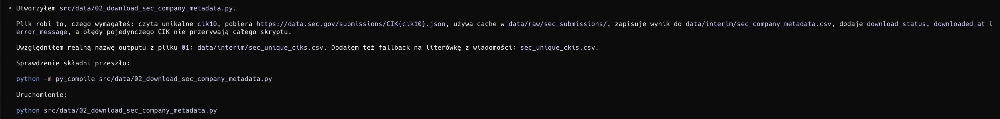

Stwórz plik src/data/02_download_sec_company_metadata.py

W repozytorium istnieje już plik 01_download_sec_ticker_map.py
Nowy plik 02_download_sec_company_metadata.py ma korzystać z wyniku poprzedniego pliku i pobierać metadane spółek po unikalnym CIK.

Ważne założenie metodologiczne:
Ten skrypt nie ma klasyfikować spółek do sektorów badawczych.
Ma tylko pobrać i uporządkować oficjalne metadane SEC.

Wymagania dotyczące pliku:
1. Na górze pliku dodaj docstring podobny stylistycznie do pliku 01, który ma jasno opisywać:
   - cel skryptu,
   - input,
   - output,
   - fakt, że skrypt pobiera metadane SEC po CIK,
   - fakt, że skrypt nie wykonuje klasyfikacji sektorowej ani selekcji próby badawczej.

2. Biblioteki mają być tylko standardowe, tak jak w pliku 01

3. Ścieżki mają być zgodne ze stylem z pliku 01 i strukturą repo

3. Skrypt ma czytać plik data/interim/sec_unique_ciks.csv (tylko unikalne cik10)

4. Dla każdego cik10 skrypt ma pobrać:
   https://data.sec.gov/submissions/CIK{cik10}.json

5. Użyj nagłówków:
   HEADERS = {
       "User-Agent": "Oskar Stachowski oskar.g.stachowski@gmail.com",
       "Accept-Encoding": "gzip, deflate",
   }

6. Dodaj prosty mechanizm cache:
   - jeśli plik data/raw/sec_submissions/CIK{cik10}.json już istnieje, nie pobieraj go ponownie,
   - w takim przypadku wczytaj dane z lokalnego pliku,
   - jeśli pliku nie ma, pobierz dane z SEC, zapisz JSON do cache i dopiero potem przetwarzaj.

7. Dodaj opóźnienie między requestami zgodnie z zasadami SEC API

8. Dodaj timeout:
   - REQUEST_TIMEOUT_SECONDS = 30

9. Dodaj podstawową obsługę błędów:
   - response.raise_for_status()
   - jeżeli pobranie pojedynczego CIK się nie uda, nie przerywaj całego skryptu,
   - zapisz dla tego CIK rekord z kolumną download_status = "error",
   - zapisz error_message z krótką treścią błędu,
   - kontynuuj kolejne CIK.

10. Dla poprawnie pobranych lub wczytanych z cache metadanych wyciągnij co najmniej następujące pola:
   - cik
   - cik10
   - name_from_ticker_map
   - name_from_sec
   - entity_type
   - sic
   - sic_description
   - fiscal_year_end
   - tickers
   - exchanges
   - source_url
   - cache_path
   - download_at
   - error_message

11. Mapowanie pól z JSON SEC:
   - name_from_sec: payload.get("name")
   - entity_type: payload.get("entityType")
   - sic: payload.get("sic")
   - sic_description: payload.get("sicDescription")
   - fiscal_year_end: payload.get("fiscalYearEnd")
   - tickers: payload.get("tickers")
   - exchanges: payload.get("exchanges")
   
12. Listy, np. tickers i exchanges, zapisz w CSV jako string rozdzielony średnikami

13. Kolumna source_url ma mieć wartość https://data.sec.gov/submissions/CIK{cik10}.json

14. Kolumna cache_path ma zawierać ścieżkę do lokalnego pliku JSON jako string.

15. Kolumna downloaded_at ma zawierać aktualny czas UTC w formacie ISO 8601.

16. Output CSV data/interim/sec_company_metadata.csv Nie zmieniaj innych plików python w repozytorium

17. Kod ma być prosty i czytelny. Nie dodawaj zewnętrznych bibliotek poza pandas i requests.

18. Zaproponowana struktura kodu:
   - constants na górze,
   - helper functions,
   - main() -> None,
   - if __name__ == "__main__": main()

