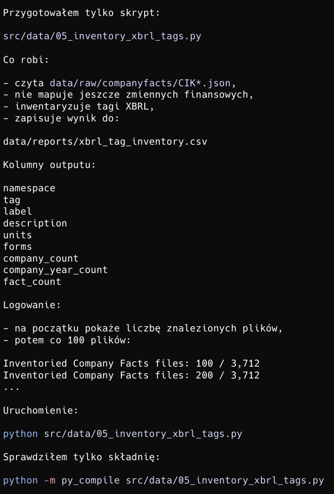

# Prompt CODEX
Na podstawie plików data/raw/companyfacts/CIK*.json przygotuj skrypt inwentaryzujący tagi XBRL.

Nie mapuj jeszcze zmiennych finansowych.

Wyniki zapisz do data/reports/xbrl_tag_inventory.csv.

Pokaż tag, namespace, label, description, jednostki, formularze, liczbę spółek, liczbę company-year i liczbę faktów.

Nie interpretuj wyników, tylko wygeneruj raport techniczny.

# Odpowiedź CODEX


# Script logging
```text
python src/data/05_inventory_xbrl_tags.py
Found Company Facts files: 3,712
Inventoried Company Facts files: 100 / 3,712
Inventoried Company Facts files: 200 / 3,712
Inventoried Company Facts files: 300 / 3,712
Inventoried Company Facts files: 400 / 3,712
Inventoried Company Facts files: 500 / 3,712
Inventoried Company Facts files: 600 / 3,712
Inventoried Company Facts files: 700 / 3,712
Inventoried Company Facts files: 800 / 3,712
Inventoried Company Facts files: 900 / 3,712
Inventoried Company Facts files: 1,000 / 3,712
Inventoried Company Facts files: 1,100 / 3,712
Inventoried Company Facts files: 1,200 / 3,712
Inventoried Company Facts files: 1,300 / 3,712
Inventoried Company Facts files: 1,400 / 3,712
Inventoried Company Facts files: 1,500 / 3,712
Inventoried Company Facts files: 1,600 / 3,712
Inventoried Company Facts files: 1,700 / 3,712
Inventoried Company Facts files: 1,800 / 3,712
Inventoried Company Facts files: 1,900 / 3,712
Inventoried Company Facts files: 2,000 / 3,712
Inventoried Company Facts files: 2,100 / 3,712
Inventoried Company Facts files: 2,200 / 3,712
Inventoried Company Facts files: 2,300 / 3,712
Inventoried Company Facts files: 2,400 / 3,712
Inventoried Company Facts files: 2,500 / 3,712
Inventoried Company Facts files: 2,600 / 3,712
Inventoried Company Facts files: 2,700 / 3,712
Inventoried Company Facts files: 2,800 / 3,712
Inventoried Company Facts files: 2,900 / 3,712
Inventoried Company Facts files: 3,000 / 3,712
Inventoried Company Facts files: 3,100 / 3,712
Inventoried Company Facts files: 3,200 / 3,712
Inventoried Company Facts files: 3,300 / 3,712
Inventoried Company Facts files: 3,400 / 3,712
Inventoried Company Facts files: 3,500 / 3,712
Inventoried Company Facts files: 3,600 / 3,712
Inventoried Company Facts files: 3,700 / 3,712
Read Company Facts files: 3,712
Inventory rows:           10,677
Errors:                   0
Saved XBRL inventory:     /Users/oskarstachowski/qnn-financial-statement-analysis/data/reports/xbrl_tag_inventory.csv
```

# Komentarz
Codex został wykorzystany pomocniczo do przygotowania skryptu `src/data/05_inventory_xbrl_tags.py`

Celem skryptu jest inwentaryzacja tagów XBRL występujących w pobranych plikach SEC Company Facts.

Skrypt nie dokonuje mapowania tagów na zmienne finansowe, to zostanie zrobione w kolejnych etapach procesowania danych.

Wygenerowany raport `data/reports/xbrl_tag_inventory.csv` ma charakter techniczny i służy jako podstawa do kolejnego etapu: mapowanie tagów XBRL do zmiennych finansowych.

Inwentaryzacja tagów została wykonana dla wszystkich `3,712` dostępnych plików `Company Facts`.

Interpretacja pliku `data/reports/xbrl_tag_inventory.csv`
* plik CSV pokazuje, jakie tagi XBRL faktycznie występują w pobranych danych SEC, w jakich przestrzeniach nazw, z jakimi jednostkami oraz w jakich formularzach
* liczba `10,677` wierszy oznacza, że w danych występuje duża różnorodność tagów, dlatego nie należy od razu zakładać jednego uniwersalnego tagu dla każdej zmiennej finansowej
* kolumny `company_count`, `company_year_count` i `fact_count` pozwalają ocenić, które tagi są powszechne i mogą być dobrymi kandydatami do mapowania, a które są rzadkie lub specyficzne dla wybranych spółek
* raport jest etapem rozpoznawczym przed właściwym mapowaniem tagów do zmiennych finansowych
