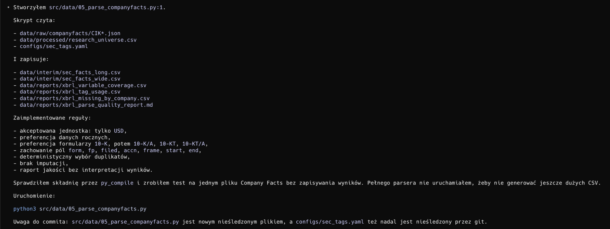

# Prompt CODEX
ZADANIE
Utwórz plik:

src/data/06_parse_companyfacts.py

Skrypt ma czytać:

1. data/raw/companyfacts/CIK*.json
2. data/processed/research_universe.csv
3. configs/sec_tags.yaml

Skrypt ma zapisywać:

1. data/interim/sec_facts_long.csv
2. data/interim/sec_facts_wide.csv
3. data/reports/xbrl_variable_coverage.csv
4. data/reports/xbrl_tag_usage.csv
5. data/reports/xbrl_missing_by_company.csv
6. data/reports/xbrl_parse_quality_report.md

WYMAGANIA TECHNICZNE

1. Używaj tylko standardowych bibliotek Pythona # na późniejszym etapie pisania kodu podjęto decyzję o uzyciu bibliotek pandas oraz PyYAML

2. Skrypt ma mieć prosty docstring na górze pliku (cel skryptu, input, output)

REGUŁY PARSOWANIA XBRL

1. Akceptowana jednostka:
   - tylko USD

2. Preferencja okresów:
   - preferuj dane roczne,
   - wykrywaj roczne fakty przez:
     - fp == "FY",
     - albo okres start-end o długości około 300-400 dni,
     - albo frame typu CY2023 lub CY2023Q4I,
     - albo formularz 10-K / 10-K/A / 10-KT / 10-KT/A dla faktów instant bez start.

3. Preferencja formularzy:
   - 10-K
   - 10-K/A
   - 10-KT
   - 10-KT/A

4. Zachowaj surowe pola SEC:
   - form
   - fp
   - filed
   - accn
   - frame
   - start
   - end
   - fy

5. Wybór duplikatów ma być deterministyczny.
   Dla tego samego:
   - cik10
   - variable
   - company_year

   wybierz jeden najlepszy fakt według kolejności:
   - annual status / annual rank,
   - preferred form,
   - zgodność fy z company_year,
   - tier z konfiguracji,
   - tag priority,
   - najnowsza data filed,
   - najnowsza data end,
   - accn,
   - namespace,
   - tag,
   - value.

6. Nie imputuj brakujących wartości. Jeśli zmienna nie występuje dla spółki/roku, zostaw brak.

7. company_year wyznaczaj w kolejności:
   - rok z pola end,
   - rok z frame typu CY2023,
   - fy,
   - jeśli nie da się ustalić roku, pomiń fakt.

STRUKTURA sec_facts_long.csv

Kolumny:

- research_universe_id
- cik
- cik10
- company_name
- primary_ticker
- research_sector
- fiscal_year_end
- company_year
- variable
- value
- unit
- namespace
- tag
- tier
- tag_priority
- form
- fp
- filed
- accn
- frame
- start
- end
- fy
- source_file

STRUKTURA sec_facts_wide.csv

Kolumny:

- research_universe_id
- cik
- cik10
- company_name
- primary_ticker
- research_sector
- fiscal_year_end
- company_year
- jedna kolumna dla każdej zmiennej z configs/sec_tags.yaml

Jeden wiersz = jedna spółka i jeden rok.

RAPORTY

1. xbrl_variable_coverage.csv

Kolumny:
- variable
- configured_tag_count
- selected_observations
- companies_with_value
- company_years_with_value
- company_coverage_ratio
- company_year_coverage_ratio
- units
- forms

2. xbrl_tag_usage.csv

Kolumny:
- variable
- tier
- tag_priority
- namespace
- tag
- selected_observations
- companies_with_selected_value
- company_years_with_selected_value
- units
- forms

3. xbrl_missing_by_company.csv

Kolumny:
- research_universe_id
- cik
- cik10
- company_name
- primary_ticker
- research_sector
- fiscal_year_end
- company_year_count
- selected_observations
- variables_with_any_value
- variables_missing_any_value
- missing_variables

4. xbrl_parse_quality_report.md

Raport markdown ma zawierać wyłącznie techniczne informacje:
- użyte inputy,
- użyte outputy,
- akceptowane jednostki,
- preferowane formularze,
- reguły przetwarzania,
- liczby:
  - companies_in_universe
  - companyfacts_files_found
  - companyfacts_files_parsed
  - missing_companyfacts_files
  - json_parse_errors
  - files_without_facts
  - candidate_facts
  - facts_rejected_unit
  - facts_rejected_nonannual
  - facts_without_value
  - facts_without_company_year
  - liczba wierszy w każdym output CSV

Raport NIE może interpretować wyników biznesowych ani finansowych.

OBSŁUGA BŁĘDÓW

Jeśli pojedynczy JSON jest uszkodzony:
   - nie przerywaj całego procesu,
   - zwiększ licznik json_parse_errors,
   - wypisz ostrzeżenie,
   - przejdź do następnej spółki.

WYJŚCIE W KONSOLI

Po uruchomieniu skrypt ma wypisać techniczne podsumowanie, np.:

Read research universe companies: 1,234
Read configured variables:        12
Read configured tag rules:        38
Parsed Company Facts files: 100 / 1,234
Parsed Company Facts files: 200 / 1,234
...
Saved long facts:           data/interim/sec_facts_long.csv
Saved wide facts:           data/interim/sec_facts_wide.csv
Saved variable coverage:    data/reports/xbrl_variable_coverage.csv
Saved tag usage:            data/reports/xbrl_tag_usage.csv
Saved missing by company:   data/reports/xbrl_missing_by_company.csv
Saved parse quality report: data/reports/xbrl_parse_quality_report.md

WYMAGANIA JAKOŚCIOWE

1. Kod ma być czytelny i modularny.
2. Podziel logikę na funkcje.
3. Nie uruchamiaj pełnego parsera automatycznie, jeśli w repo są tysiące JSON.
4. Po utworzeniu pliku wykonaj tylko bezpieczne walidacje:
   - python3 -m py_compile src/data/06_parse_companyfacts.py
   - opcjonalnie test parsera na jednym losowym pliku JSON, bez zapisywania pełnych outputów.
5. Na końcu odpowiedzi wypisz:
   - jakie pliki zostały utworzone lub zmienione,
   - jakie inputy skrypt czyta,
   - jakie outputy generuje,
   - jakie reguły zostały zaimplementowane,

# Odpowiedź CODEX


# Script logging
```text
python src/data/06_parse_companyfacts.py
Read research universe companies: 3,730
Read configured variables:        26
Read configured tag rules:        54
Parsed Company Facts files: 100 / 3,730
Parsed Company Facts files: 200 / 3,730
Parsed Company Facts files: 300 / 3,730
Parsed Company Facts files: 400 / 3,730
Parsed Company Facts files: 500 / 3,730
Parsed Company Facts files: 600 / 3,730
Parsed Company Facts files: 700 / 3,730
Parsed Company Facts files: 800 / 3,730
Parsed Company Facts files: 900 / 3,730
Parsed Company Facts files: 1,000 / 3,730
Parsed Company Facts files: 1,100 / 3,730
Parsed Company Facts files: 1,200 / 3,730
Parsed Company Facts files: 1,300 / 3,730
Parsed Company Facts files: 1,400 / 3,730
Parsed Company Facts files: 1,500 / 3,730
Parsed Company Facts files: 1,600 / 3,730
Parsed Company Facts files: 1,700 / 3,730
Parsed Company Facts files: 1,800 / 3,730
Parsed Company Facts files: 1,900 / 3,730
Parsed Company Facts files: 2,000 / 3,730
Parsed Company Facts files: 2,100 / 3,730
Parsed Company Facts files: 2,200 / 3,730
Parsed Company Facts files: 2,300 / 3,730
Parsed Company Facts files: 2,400 / 3,730
Parsed Company Facts files: 2,500 / 3,730
Parsed Company Facts files: 2,600 / 3,730
Parsed Company Facts files: 2,700 / 3,730
Parsed Company Facts files: 2,800 / 3,730
Parsed Company Facts files: 2,900 / 3,730
Parsed Company Facts files: 3,000 / 3,730
Parsed Company Facts files: 3,100 / 3,730
Parsed Company Facts files: 3,200 / 3,730
Parsed Company Facts files: 3,300 / 3,730
Parsed Company Facts files: 3,400 / 3,730
Parsed Company Facts files: 3,500 / 3,730
Parsed Company Facts files: 3,600 / 3,730
Parsed Company Facts files: 3,700 / 3,730
Saved long facts: /Users/oskarstachowski/qnn-financial-statement-analysis/data/interim/sec_facts_long.csv
Saved wide facts: /Users/oskarstachowski/qnn-financial-statement-analysis/data/interim/sec_facts_wide.csv
Saved variable coverage: /Users/oskarstachowski/qnn-financial-statement-analysis/data/reports/xbrl_variable_coverage.csv
Saved tag usage: /Users/oskarstachowski/qnn-financial-statement-analysis/data/reports/xbrl_tag_usage.csv
Saved missing by company: /Users/oskarstachowski/qnn-financial-statement-analysis/data/reports/xbrl_missing_by_company.csv
Saved parse quality report: /Users/oskarstachowski/qnn-financial-statement-analysis/data/reports/xbrl_parse_quality_report.md
```

# Komentarz

## data/interim/sec_facts_long.csv
* Długa tabela faktów finansowych.
* Jeden wiersz = jedna zmienna finansowa dla jednej spółki i jednego roku, np. assets dla Apple w 2020.
* Zawiera też źródłowy tag XBRL, formularz, datę złożenia, accession number, okres start/end itd.
* Plik do audytu źródła danych.
* Plik jest generowany lokalnie i pominięty w git ze względu na rozmiar.

## data/interim/sec_facts_wide.csv
* Szeroka tabela do dalszego modelowania.
* Jeden wiersz = jedna spółka w jednym roku. Kolumny to zmienne finansowe, np. assets, revenues, net_income, cash.
* Główny kandydat na input do dalszego pipeline’u analitycznego/modelowego.

## data/reports/xbrl_variable_coverage.csv
* Raport pokrycia na poziomie zmiennych.
* Pokazuje dla każdej zmiennej, ile ma obserwacji, ile spółek ma daną zmienną, ile company-year ma wartość oraz jakie formularze i jednostki zostały użyte.
* Służy do oceny braków danych.

## data/reports/xbrl_tag_usage.csv
* Raport użycia konkretnych tagów XBRL.
* Pokazuje, które tagi z sec_tags.yaml faktycznie zostały użyte do zbudowania zmiennych i jak często.
* Przydatne do sprawdzenia, czy fallbacki są realnie wykorzystywane.

## data/reports/xbrl_missing_by_company.csv
* Raport braków na poziomie spółki.
* Dla każdej spółki pokazuje, ile ma lat danych, ile obserwacji finansowych, ile zmiennych występuje przynajmniej raz i których zmiennych brakuje całkowicie.

## data/reports/xbrl_parse_quality_report.md
* Krótki techniczny raport jakości parsowania.
* Podsumowuje inputy, reguły parsowania, liczbę przetworzonych plików, brakujące JSON-y, odrzucone fakty i liczbę wygenerowanych wierszy.
