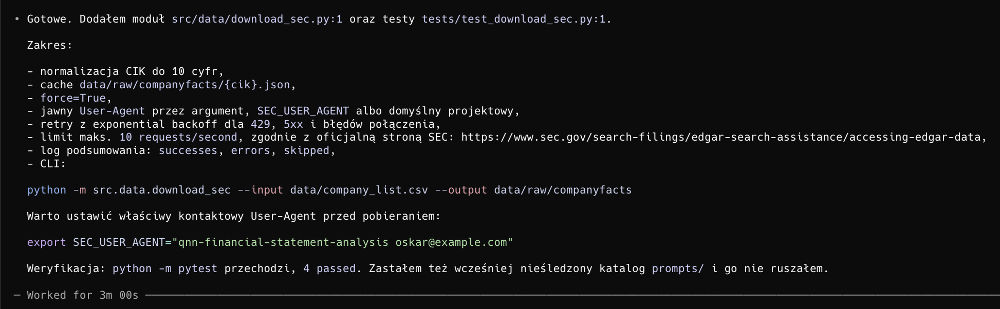

# Napisany przez autora pracy magisterskiej prompt
Stwórz moduł Python do pobierania danych SEC Company Facts dla listy spółek.

Kontekst:
- Pracuję nad pracą magisterską o porównaniu klasycznych modeli ML i hybrydowych QNN w analizie ryzyka finansowo-sprawozdawczego.
- Dane mają pochodzić z SEC Company Facts (API).
- Chcę mieć lokalny cache raw JSON.
- Projekt ma być prosty, czytelny i badawczy, nie produkcyjny.

Wymagania:
1. Utwórz plik src/data/download_sec.py.
2. Funkcja powinna przyjmować listę CIK.
3. Każdy CIK normalizuj do 10 cyfr.
4. Zapisuj każdy wynik jako data/raw/companyfacts/{cik}.json.
5. Jeśli plik już istnieje, nie pobieraj ponownie, chyba że podam flagę force=True.
6. Ustaw jawny User-Agent w nagłówkach.
7. Dodaj obsługę błędów HTTP i retry z backoff.
8. Dodaj limit tempa pobierania zgodny z zasadami SEC Company Facts
9. Zapisz log z liczbą sukcesów, błędów i pominięć.
10. Dodaj prosty CLI:
    python -m src.data.download_sec --input data/company_list.csv --output data/raw/companyfacts
11. Dodaj testy jednostkowe dla normalizacji CIK i logiki cache.
12. Nie dodawaj niepotrzebnej architektury.

# Otrzymany output Codex


# Weryfikacja kodu
Wygenerowany kod został zweryfikowany przez autora pracy i zapisany w repozytorium jako commit:

```text
dane: pobieranie danych SEC
```
